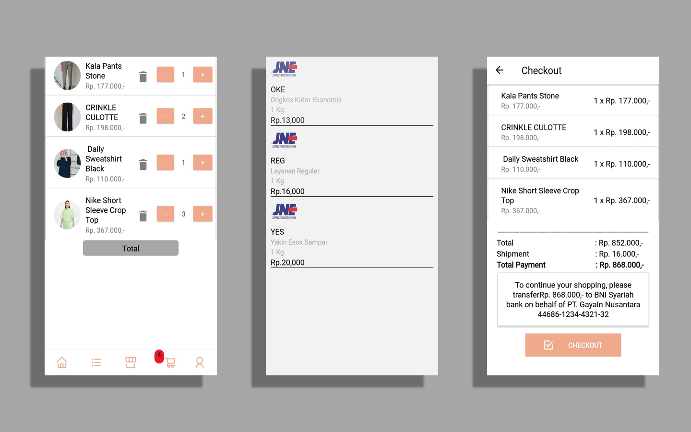

<h1 align="center">
  <a href="">
  </a>
</h1>

<p align="center">
  <a href="https://github.com/facebook/react-native/blob/master/LICENSE">
    
  </a>
  <a href="https://circleci.com/gh/facebook/react-native">
    
  </a>
  <a href="https://www.npmjs.org/package/react>
    
  </a>
  <a href="https://reactnative.dev/docs/contributing">
    
  </a>
</p>

## SCREENSHOOT DEMO
- <b>Product and Home </b>


- <b> Cart and Payment </b>



## Table Of Contents
*  [Intro](#Intro)
*  [Requirments](#Requirments)
*  [Related Projects](#Related-Projects)
*  [Dependencies](#Dependencies)
    *  [Clone Repo](#Clone-Repo)
    *  [Install Depedencies](#Install-Depedencies)
    *  [Update Depedencies](#Update-Depedencies)
    *  [Setup Environment](#Setup-Environment)
    *  [Run server development](#Run-server-development)
    *  [Build For Production](#Build-For-Production)
* [Dependencies](#Dependencies)
* [License](#License)
___
### Intro

Gayain is an e-commerce application collaboration project with the team at the Arkcademy bootcamp.
Gayain includes web and mobile platforms. Mobile applications are used for marketing,
while for the web platform it is used for product, user, and category management.
This application was built with React and React native, shipping gateway using the API
rajaongkir

___
### Features
- [x] Fancy UI Design
- [x] Simple Add to cart and manipulate quantity in checkout
- [x] Order product
- [x] Count payment receipt
- [x] Authentication with JWT in backend and redux persist
- [x] Persist and rehydrate a redux store
- [x] Shipping Gateway with Rajaongkir
___
### Requirments

* [Nodejs](https://nodejs.org/en/) v10 LTS version
* [Npm](https://www.npmjs.com/get-npm) package / [Yarn](https://yarnpkg.com/lang/en/docs/install/#mac-stable) package
___

### Related Projects
This project is related to several platforms

* Backend [https://github.com/gayain/gayaIn-Backend](https://github.com/gayain/gayaIn-Backend)
* Web App [https://github.com/gayain/gayaIn-Frontend-Web](https://github.com/gayain/gayaIn-Frontend-Web)
* Mobile App [https://github.com/gayain/gayaIn-Frontend-Mobile](https://github.com/gayain/gayaIn-frontend-Mobile)
___

### Installation

##### Clone Repo
clone the repository

```sh
$ git clone https://github.com/gayain/gayaIn-Frontend-Mobile
$ cd gayaIn-Frontend-Mobile
```

##### Install Depedencies

```sh
$ npm install
```

##### Update Depedencies

```sh
$ npm update
```

##### Setup Environment
Before project development or build for production, you should create new .env file, edit API_KEY  variable to backend server. you can found the backend server here.. [https://github.com/gayain/gayaIn-Backend](https://github.com/gayain/gayaIn-Backend)

```sh
API_KEY=<Backend-api-url>
```

##### Run on android device
if you want start on development mode.

```sh
$ npx react-native run-android
```

##### Run on ios device
if you want start on development mode.

```sh
$ npx react-native run-ios
```

##### Build For Production
build for production ready, and host ready

```sh
$ cd android && ./gradlew --assembleRelease
```
___

### Dependencies

List of depedencies using in this project

| Plugin | Description |
| ------ | ------ |
| [React Native](https://facebook.github.io/react-native/) | Mobile Apps Framework |
| [Axios](https://github.com/axios/axios) | HTTP client for request API |
| [Redux](https://redux.js.org) | Global State Management |
| [Redux Promise Middleware](https://www.npmjs.com/package/redux-promise-middleware) | Promise handler for react redux 
| [Redux Persist](https://www.npmjs.com/package/redux-persist) | Persist and rehydrate a redux store
| [React Native dotenv](https://www.npmjs.com/package/react-native-dotenv) | React Native dotenv
| [React Native Image Picker](https://www.npmjs.com/package/react-native-image-picker) | React Native Image Picker
| [React Native Navigation](https://reactnavigation.org/) | React Native Navigation
| [React Native Ionicons](https://www.npmjs.com/package/react-native-ionicons) | React Native Ionicons

License
----

MIT


@2020 - gayaIn Team
